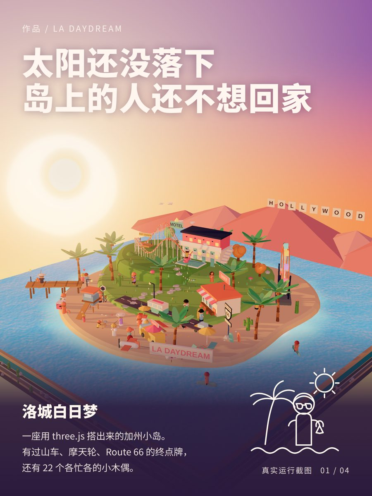
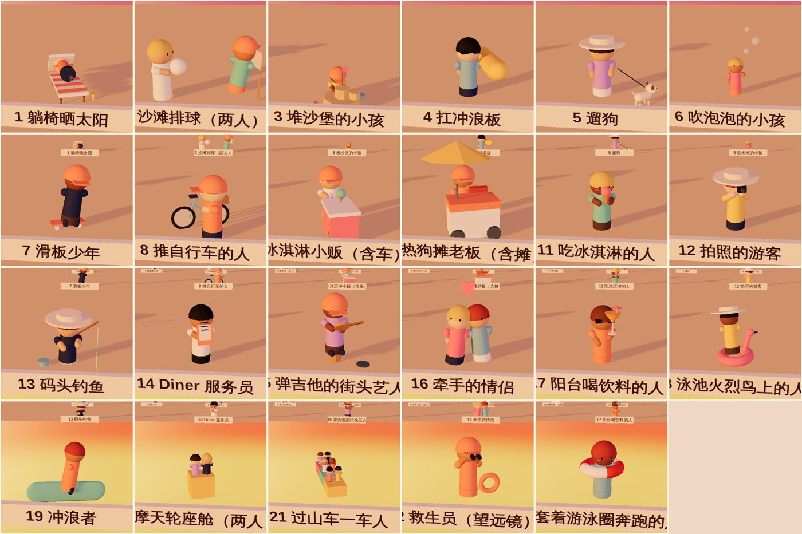

# 3D 微缩小世界

让 AI 用 three.js 帮你做一个「3D 微缩小世界」网页：一块方形海洋底座，上面一座布满小建筑和小木偶的岛，
有光照氛围、会动的元素和背景音乐，还能做出发小红书的海报。

这是一份 **AI-Friendly 的做法 + 参考实现**。把 `threejs-mini-world` 这个文件夹交给支持文件读写的 AI
（Claude Code、Cursor 之类都可以），它会照着 `SKILL.md` 里的流程，先和你聊清楚想做什么，再用
`template/` 里的参考实现，做出一座属于你的主题的小世界。

> 参考实现是「LA Daydream」：一座加州落日小岛，有过山车、摩天轮、Route 66 终点牌，
> 还有 22 个各忙各的小木偶。

---

## 想做自己的小世界？先看怎么发 prompt

不要一上来就说「帮我做一个 3D 小岛」。按下面 6 步，一步一步发，每一步都让 AI 渲染截图给你看：

| 步骤 | 你要做的事 | 可以这样说 |
| --- | --- | --- |
| ① 开场 | 给参考图 + 目标，并要求**先讨论** | 「我想用 three.js 做一个 3D 微缩的【主题】交互网站，参考图见附件，要有【昼夜 / 季节 / 背景音乐】。**先别动手，我们先讨论做什么、不做什么。**」 |
| ② 定范围 | 让它列清单并给推荐 | 「请列出第一版做什么、不做什么，并告诉我你的推荐。」 |
| ③ 定风格 | 先看样张再选 | 「先给我 5 种视觉风格的样图让我选，必须是真实 3D 渲染，不要平面草图。」 |
| ④ 分批打磨 | 每次只改一类问题 | 「地质层太厚，做薄一点；岛大一点，里面的元素小巧精致一点。」 |
| ⑤ 带截图反馈 | 在截图上画红框 | （发截图）「这几处穿模了，请移动位置。」 |
| ⑥ 复杂元素先出总表 | 先确认再放回场景 | 「先把所有小人画成一张总表，我确认每个人的动作和道具，再放回岛上，放回去时不要和场景穿模。」 |

**可以直接复制的万能开头：**

```text
帮我用 three.js 搭一个 3D 微缩的【主题，如：日本夏日小镇 / 雨夜便利店】小世界。风格参考附图。
需要【昼夜 / 季节 / 背景音乐】。请先自己安装相关 skill，然后先和我讨论范围和风格，我确认后再开始。
每一步都渲染截图给我看，避免做完大改。
```

几条经验：

1. **多给图，少给形容词。** 一张参考图比「可爱治愈」管用得多。
2. **开场加「先别动手，我们先讨论」**，AI 才会先给范围清单，而不是直接写出一堆你不想要的东西。
3. **发问题时直接在截图上画红框**，比文字描述准十倍。
4. **一次只改一类问题**，同时改风格、布局、人物，容易互相覆盖。
5. **想要的细节写成真实对象**：比如「圣莫妮卡码头的 Route 66 终点牌」，比「公路牌」准确得多。
6. **动作要有道具**：只说「站着」小人会呆，说「举着菜单的服务员」就有故事。

完整的分步话术（含音乐、小红书海报）在 `references/prompts.md`。

---

## 长什么样



- 方形海洋底座（薄薄的分层岩石切片）+ 一座有台地、沙滩、草坪的小岛
- 日落光照：橙红到橘黄的天空、带光晕的太阳、会闪的碎银水面
- 会动的东西：转动的摩天轮、沿轨道跑的过山车、拉横幅的小飞机、扇翅膀的海鸥、漂浮的火烈鸟、上升的泡泡
- 22 个小木偶，每个都有道具和动作（推自行车的、举菜单的服务员、捧冰淇淋的、牵手看日落的……）
- 背景音乐：现场合成的海浪、风、海鸥，加一段慢节奏 lo-fi，点「进入」后开始，右下角可静音
- 视角：鼠标拖动 / 滚轮，加键盘 A/D 环绕、W/S 俯仰、Q/E 远近



---

## 怎么用

最省事的方法：打开你自己的 AI（Claude Code、Cursor、Codex 这类能读写文件、能联网的都可以），
把下面这段话整段复制发给它，**同时发 2~3 张你喜欢的 3D 小世界参考图**：

```text
请用这个项目帮我做一个 3D 微缩小世界网页：
https://github.com/BeautifulJosie/yangchunmian/tree/main/threejs-mini-world

我想做的主题是：【比如：日本夏日小镇 / 雨夜便利店 / 我家的小院子】
我想要的氛围：【比如：白天黑夜 / 四季 / 背景音乐】
参考图见附件。

1. 先把这个文件夹完整下载到我电脑上一个新文件夹里，比如运行
   npx degit BeautifulJosie/yangchunmian/threejs-mini-world my-mini-world
   如果用不了这条命令，可以用 git 稀疏检出，或者逐个下载里面的文件。
2. 读里面的 SKILL.md，严格按它的流程来：先跟我讨论做什么、不做什么，
   再渲染几个风格样张让我选，我确认以后再动手。
3. 每一步都用截图给我看，不要一次做完再给我。
4. 做完告诉我文件在哪、怎么运行。
```

AI 会自己下载、读规范、先和你聊范围和风格，再一步步做。你只需要看截图、说哪里要改。

如果你的 AI 不能联网或不能操作文件：点仓库首页的「下载这个文件夹」，解压后把整个文件夹交给它，
告诉它「请照着这个文件夹里的 SKILL.md 帮我做一个 3D 小世界」。

更多对话技巧见上面「想做自己的小世界？先看怎么发 prompt」。

---

## 本地运行

需要 Node.js 18 以上。

```bash
cd template
npm install
npm run dev          # 打开 http://localhost:5173，点「进入」开始播放音乐
npm run build        # 打包到 dist/，丢到任何静态托管就能访问
```

想让 AI 自己渲染截图检查效果（不需要显卡）：

```bash
npm run dev          # 先让页面跑起来
npm run shoot        # 渲染 3 个全景角度到 shots/
```

第一次用 Playwright 需要有一个 Chromium。如果脚本找不到，运行 `npx playwright install chromium`，
或者设置环境变量 `CHROMIUM_PATH` 指向你自己的 Chrome。

---

## 文件夹里有什么

```text
threejs-mini-world/
├─ SKILL.md              给 AI 看的完整流程（先聊范围→定风格→搭场景→做角色→自检→音乐→海报）
├─ README.md             你正在看的这份
├─ references/
│  ├─ lessons.md         做这个项目时踩过的坑和解决办法
│  └─ prompts.md         和 AI 对话的话术示例
├─ preview/              效果图
└─ template/             参考实现（Vite + TypeScript + three.js）
   ├─ src/               场景、角色、天空、水面、配乐
   ├─ scripts/           无头渲染截图、角色逐个渲染、离线渲染音乐、合成海报
   └─ poster/            小红书 3:4 海报模板（HTML）
```

---

## 目前做到哪、没做什么

已经有：标准的落日场景、22 个角色、动态元素、配乐、键盘视角控制、海报模板。

**还没有**（需要的话让 AI 接着做）：

- 夜晚和四季的光照预设（代码里已经按「预设」组织，加预设就行）
- 素材栏 + 把小人、椰子、小飞机拖到空岛上的拼贴玩法（`characters.ts` 的目录结构就是为它准备的）
- 保存和分享

---

## 数据与隐私

没有后端、没有数据库、不收集任何数据。页面里的内容就是代码本身。
如果之后发布成公网链接，别把不想被别人看到的内容写进页面。

## 关于音乐

配乐是现场合成的，不依赖任何音频文件，没有版权问题。浏览器规定用户必须先点一下页面才能出声，
所以页面开头有「点击进入」。AI 自己听不到声音，能检查的只有「没报错、没削波」，好不好听要你自己听，
觉得海浪太大、旋律太空，让 AI 调。

---

## About

这套做法来自一次真实的对话式创作：从一张参考图出发，经过讨论范围、选风格、反复修小人穿模，
一路做成了现在这座岛。里面的 `references/lessons.md` 记着每一个返工的原因。

## License

MIT
