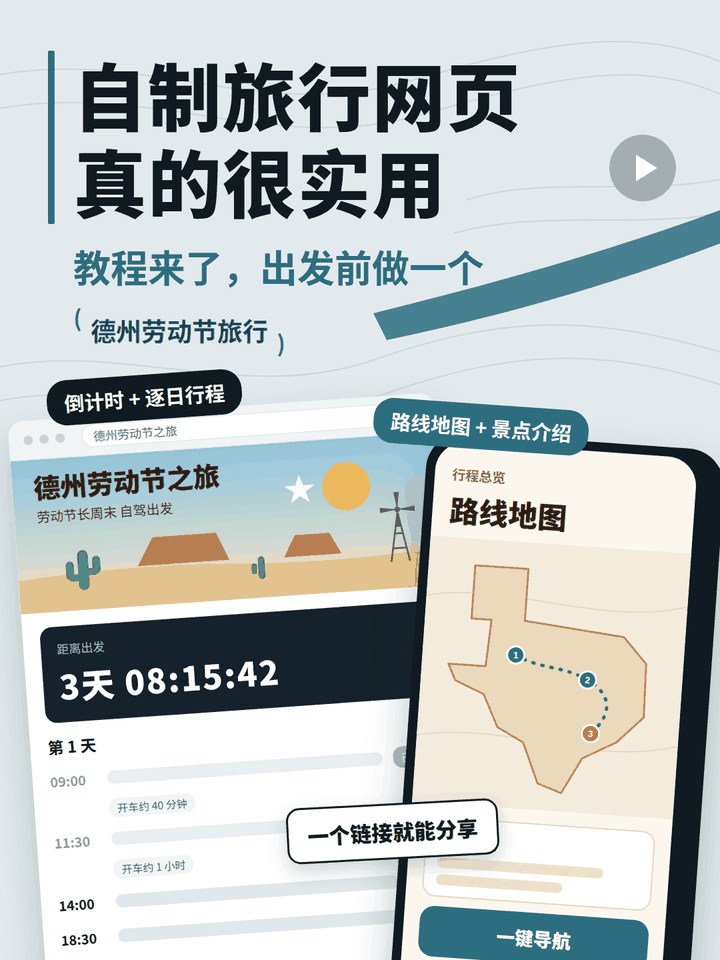
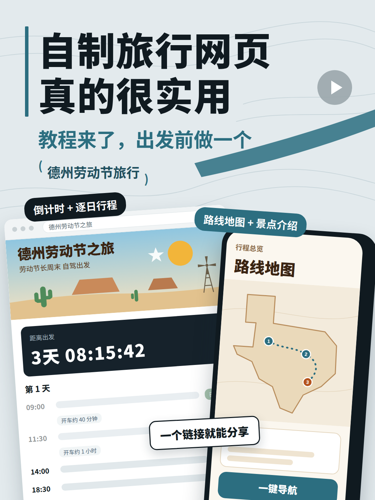

# 小红书视频封面

让 AI 按同一套风格帮你做小红书视频封面：浅蓝灰底、粗黑大标题、倾斜的网页和手机示意图。每期只换标题和内容，整个系列一眼就能认出来。做完直接导出 1080×1440 的 PNG，拿去就能上传。

---

## 封面长什么样

| 两个案例 | 单个主题 | 工具演示 |
| --- | --- | --- |
|  |  |  |

- **两个案例**：适合对比类视频，比如「洛杉矶一日游 & 桂林行程」。
- **单个主题**：适合讲一件事的视频，比如「德州劳动节旅行」。
- **工具演示**：适合介绍 App 或 AI 工具的视频，比如「豆包当小导游」。

### 真实案例

用这个工具给「阳春面」视频做的封面：

| 1w赞的旅行网页，我做成Skill了 | 德州劳动节旅行 |
| --- | --- |
|  |  |

---

## 怎么用

**不用自己下载。** 打开你自己的 AI（Claude Code、Cursor、Codex 这类能读写文件、能运行命令、能联网的都可以），把下面这段话整段复制发给它，再告诉它这期视频讲什么：

```text
请用这个工具帮我做一张小红书视频封面：
https://github.com/BeautifulJosie/yangchunmian/tree/main/xhs-video-cover

1. 先把这个文件夹完整下载到我电脑上，比如运行
   npx degit BeautifulJosie/yangchunmian/xhs-video-cover xhs-video-cover
   如果用不了这条命令，可以用 git 稀疏检出，或者逐个下载里面的文件。
2. 读里面的 SKILL.md，严格按它的规范来：先问我标题和内容，再选模板改，最后导出 PNG。
3. 做完告诉我图片在哪。
```

AI 会问你几件事：大标题、副标题、视频讲的是什么、用了什么工具。有视频截图的话一起发给它，画出来会更像。

以后再做封面，跟 AI 说「用 xhs-video-cover 给这期视频做个封面」就行。需要的话，它还能顺手帮你写小红书的标题和正文简介。

如果你用的 AI 不能联网或不能操作文件：点仓库首页的「下载这个文件夹」，解压后把整个文件夹交给它，告诉它「请照着这个文件夹里的 SKILL.md 帮我做一张小红书封面」。

---

## 自己改着玩

`template/` 里的三个 HTML 用浏览器直接打开就能看。文字可以直接改，主色改文件开头的 `--accent` 就行。

出图需要 Python 和 playwright，AI 会帮你装好。装不上也没关系：用 Chrome 打开 HTML，按 F12，在 Elements 里右键 `<div id="cover">`，选「Capture node screenshot」，也能截出一样的图。

**遇到任何问题都直接问你的 AI。** 截个图发给它，让它一步步帮你解决。

---

## 文件说明

```
xhs-video-cover/
├── SKILL.md          AI 照着做的风格规范和步骤
├── template/         三个封面模板（HTML）
├── examples/         三个模板的示例图 + 真实案例
└── scripts/render.py 把 HTML 导出成 PNG
```

---

## License

MIT
